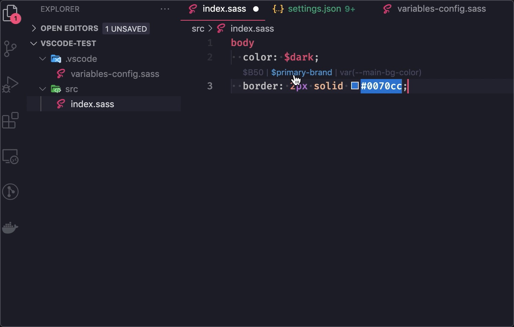

# scss-color-transformation README

Convert color values ​​into variables.


#### `sass-color-transformation.enableCodeLens`

Enable color codeLens.

#### `sass-color-transformation.variablesConfigPath`

The path of the variables configuration file.

#### `sass-color-transformation.languages`

Defines which languages have color transformation enabled. The languages that are turned on by default are `css`, `sass`, `scss`, `less` and `stylus` documents:

```json
"sass-color-transformation.languages": [
  "scss",
  "sass",
  "stylus",
  "less"
]
```

## Get Started

### create a variables config file first (use sass extension please)

for example, we create a sass file named `variables-config.sass` and put it in `.vscode` folder

``` sass
$B40: #5AAFF5;
$B50: #0070CC;
$B60: #005AA5;

$snow: #fff;
$dark: #000;
$snow-background: rgba(255, 255, 255, 1);
$border-brand: $B40;
$primary-brand: $B50;
$hover-brand: $B60;
--main-bg-color: $primary-brand;
```

### Now we can try to write a css color in a sass file



```sass
body
  background-color: #0070CC
```
